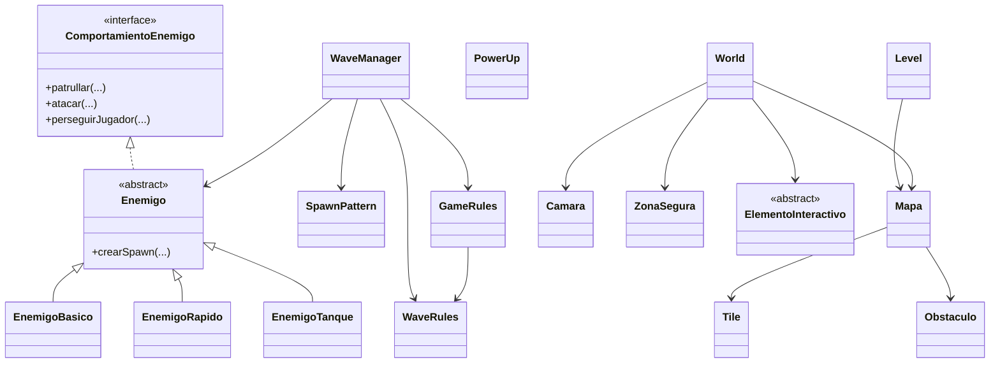

# Survival Mode Restructure

## Overview

This update transforms the default game flow from free asteroid spawning into **wave-based survival** with finite map support.

Main goals implemented:

- Enemy hierarchy (`Enemigo` + variants)
- Wave orchestration (`WaveManager`)
- Survival game rules and score (`gamerules.GameRules`)
- Closed map model (`Mapa`, `Tile`, `Obstaculo`)
- Finite world helpers (`World`, `Camara`, `ZonaSegura`)
- Main bootstrap adapted to survival mode

## Main Class Changes

- [Main.java](../src/Main.java) now boots `SurvivalWorldDefinitionProvider`
- Creates a procedural closed map through `Mapa.generarBasico(...)`
- Uses `gamelevel.Level` (survival level) instead of `LevelBasic`
- Activates `WaveManager` with states:
  - `PREPARING`
  - `WAVE_ACTIVE`
  - `WAVE_CLEARED`
  - `GAME_OVER`
  - `VICTORY`

## New/Updated Packages

### gameai

- `Enemigo` (abstract base)
- `EnemigoBasico`, `EnemigoRapido`, `EnemigoTanque`
- `ComportamientoEnemigo`
- `SpawnPattern`
- `WaveManager`

### gamelevel

- `Level` (survival map-aware level)
- `Mapa`
- `Tile`
- `Obstaculo`

### gamerules

- `GameRules` (survival-oriented rules + score)
- `WaveRules` (wave composition, rest time, difficulty multipliers)
- `PowerUp` (optional upgrades enum)

### gameworld

- `SurvivalWorldDefinitionProvider`
- `World`
- `Camara`
- `ZonaSegura`
- `ElementoInteractivo`

## Class Diagram (Mermaid)



## Build and Run

Prerequisites:

- Java 21
- Maven 3.9+

Commands:

```bash
mvn clean compile
mvn exec:java -Dexec.mainClass=Main
```

> Note: In this environment Maven CLI is not installed, so full command execution could not be validated here.
